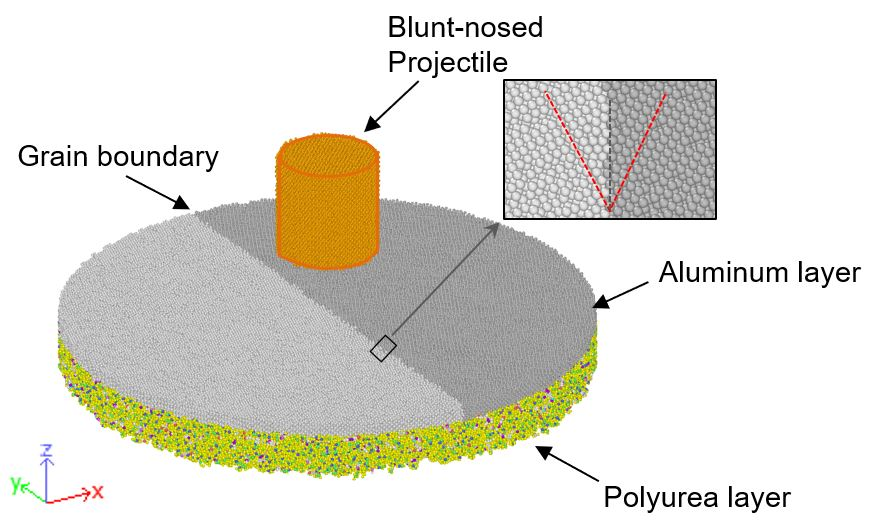
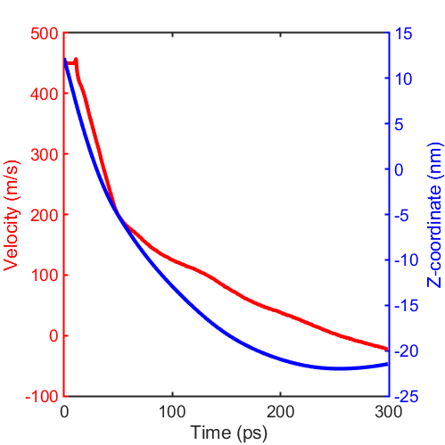

# Molecular dynamics simulations of ballistic impact tests

I would like to share a molecular dynamics (MD) model used in our recent paper published in
 [Computational Materials Science](https://www.sciencedirect.com/science/article/abs/pii/S0927025621002299). This repository contains the LAMMPS files required to run MD simulations of impact tests of the aluminum/polyurea structure shown below. The LAMMPS data file (164 MB) can be downloaded [from here](https://drive.google.com/file/d/1J8zSFvw8cZQ8xSUp9quD7xxAviviOzIl/view?usp=sharing). The input and parameters files are available above (“impact_in.in” and “impact_para.params”)

 

The provided MATLAB code, projectile_z_v.m, can be used to track the position and velocity of the projectile; a plot when the impact velocity is 450 m/s is shown below.

 

If you are using [Compute Canada](https://www.computecanada.ca/home/), the "sub.sh" script can be used to submit the job. The simulation will need ~XXX core-hours.

If you would like to learn more about the model, please read [our paper](https://www.sciencedirect.com/science/article/abs/pii/S0927025621002299). 

Good luck with your MD simulations.
